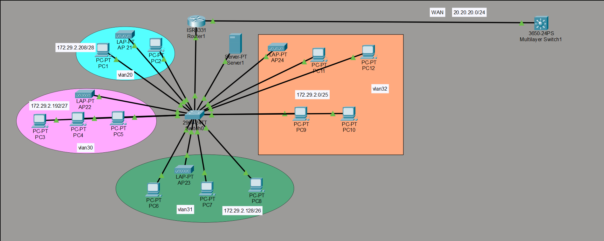

# Multi-VLAN Enterprise Network Lab

A Cisco Packet Tracer lab that builds a small enterprise LAN behind one router, with inter-VLAN routing, DHCP for every VLAN, PAT with an extended ACL, a protected internal server, and a simulated ISP link.

## What this lab covers

| Feature | Summary |
|---|---|
| Inter-VLAN routing | Router-on-a-stick: one trunk, many sub-interfaces |
| DHCP | R1 serves every VLAN, including guest Wi-Fi |
| NAT | PAT (overload) using extended ACL 100, translated to `20.20.20.1` |
| Internal server | Own VLAN, reachable from the LAN only, blocked from the public network |
| Switching | RSTP, PortFast on edge ports, custom native VLAN, unused ports shut down |
| Routing | Static route to the WAN network plus a default route |

**Skills practiced:** VLANs, 802.1Q trunking, sub-interfaces, VLSM, DHCP, PAT, extended ACLs, static and default routing, RSTP, basic switch hardening.

## Devices

| Device | Model | Role |
|---|---|---|
| R1 | ISR4331 | Main router: DHCP, NAT, inter-VLAN routing |
| SW1 | Layer 2 switch (24 x FastEthernet) | Access and trunk switching |
| ISP-L3 | 3650-24PS | Simulated ISP/WAN router |
| PC1 to PC12 | PC-PT | End hosts |
| Server1 | Server-PT | Internal server |
| AP21 to AP24 | LAP-PT | Access points for guest Wi-Fi |

## Repository contents

| Folder | What is inside |
|---|---|
| [`topology/`](topology/) | Diagram image, Packet Tracer file, [addressing plan](topology/addressing-plan.md) |
| [`configs/`](configs/) | Device configurations: [SW1](configs/SW1.txt), [R1](configs/R1.txt), [ISP-L3](configs/ISP-L3.txt) |
| [`tasks/`](tasks/) | [Original requirements](tasks/requirements.md), [completion checklist](tasks/completed.md), [verification tests](tasks/verification.md) |
| [`docs/`](docs/) | [Traffic flow walkthrough](docs/traffic-flow.md), [troubleshooting](docs/troubleshooting.md) |

## Quick start

1. Open `topology/lab.pkt` in Cisco Packet Tracer.
2. Paste each file from `configs/` into the matching device CLI (global config mode).
3. Run the tests in [`tasks/verification.md`](tasks/verification.md).

## Important design notes

The original task had a few conflicts, fixed as follows. Details are in the [addressing plan](topology/addressing-plan.md).

- VLAN 20 was moved to `172.29.2.224/28` because the original range overlapped VLAN 30.
- VLAN 999 (`172.29.99.0/30`) is outside the `/22` block but works as a separate connected subnet.
- The default route uses R1's own port `Gi0/0/1`, not the ISP switch port.

## Author

**Samir** · Networking student, CCNA
